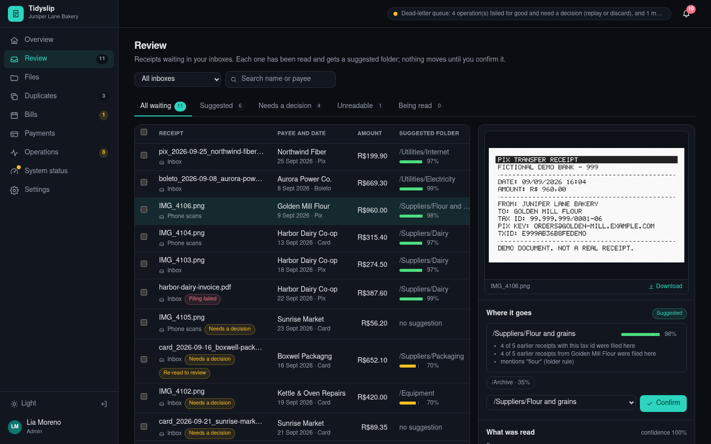
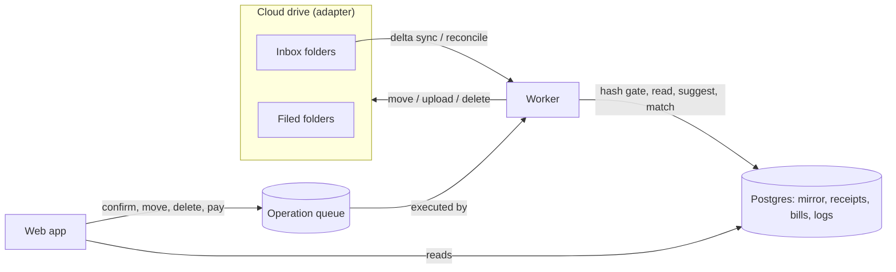

# receipt-organizer

**Organizes payment receipts and bills from a cloud drive: it reads them, files them, spots duplicates and tracks what has been paid.**

*In plain words:* A small business (or a busy household) ends up with receipts everywhere: PDFs from the bank app, photos taken on a phone, boletos, card slips. This app watches a folder in your cloud drive where you drop them. It reads each one (who was paid, how much, when, how), suggests the folder it belongs in and waits for you to say yes. It notices when the same receipt arrives twice and proves it before anything is deleted. It knows your monthly bills, so it can tell you which ones are paid and which are late, and it can even pay a bill and file the receipt that comes back. Nothing is moved, deleted or paid unless a person asks for it.


The demo runs under the made-up brand **Tidyslip**, for a made-up bakery called Juniper Lane. Every person, company, tax id, key and document in it is invented.

## Why I built it

I built the first version of this for real use: a few hundred receipts a month landing in a cloud drive, filed by hand into folders, and a spreadsheet to remember which bills were paid. The filing was the boring part. The dangerous parts were quieter:

- a receipt dropped twice got filed twice, or worse, "cleaned up" by deleting the wrong copy;
- a move that timed out had actually happened, so the retry failed with "name already exists" six times in a row and nobody noticed;
- a sync lock held by a process that had died kept everything frozen until someone looked;
- bulk re-reading worked for ten files and fell over at eleven.

This repository is a clean rebuild of that product from the problems it had to solve, written to be read. The interesting code is not the screens; it is the queue that makes every drive change safe to retry, the gate that keeps duplicates out, and the rule that a suggestion is only a suggestion.

## What you can do

- **Review** receipts waiting in any of your inboxes. Each one shows a preview, the fields that were read and a suggested folder with a confidence bar and the reasons behind it. At 80% or more it is marked "suggested" and can be confirmed in bulk; below that it says "needs a decision". Either way, a person confirms.
- **Correct** what was read. Your edits win over any later automatic reading. **Re-read** one receipt or hundreds: re-reading runs in the background and comes back as a before/after diff you accept field by field.
- **Browse files** in a folder tree. Drag files or folders onto a folder to move them, create, rename and delete folders, select many and move, delete, re-read or download them as a ZIP. Changes that are still on their way show up immediately with a badge (optimistic overlay) and turn into a red "failed" badge if the drive refuses.
- **Decide on duplicates.** Copies are caught at intake by their SHA-256 and held out of review. "Check bytes" compares the two files byte by byte; "Delete" is a separate job with a progress bar that re-proves each file right before deleting it.
- **Track bills.** Recurring bills (fixed or variable amounts) are matched to receipts by payment date and amount, so every month shows paid, open or overdue, with the receipt that paid it.
- **Pay** a bill by Pix, transfer or boleto through a payment provider (a mock one here). The provider's receipt is uploaded into your inbox through the same queue, read, and marks the bill paid.
- **Run the operations center**: one list for the audit trail, the operation queue, receipt reading, sync and duplicates, filtered, searched and paged on the server. Problems stay *open* until someone deals with them; every row offers the actions that apply (replay, replay with a free name, discard, read again, mark handled), in bulk too, and a trace id links everything one click caused.
- **Check system status**: one verdict on top ("working, with something to look at"), then database, worker heartbeat, sync, change subscription (with a "Renew now" that really renews), circuit breakers, dead-letter queue, backlog and reading.
- **Manage people**: admins, members limited to certain folders, and read-only viewers. Profile, theme (light or dark) and notification preferences per person.

| | |
|---|---|
|  |  |
| Overview: what needs you today | Re-reading proposes changes; you pick which to keep |
|  |  |
| Files with folder tree, drag and drop and preview | Duplicates side by side, proven byte by byte |
|  |  |
| Bills and the receipts that paid them | Payments with the receipt the provider returned |
|  |  |
| Operations center: open problems, attempts, same trace | System status with a single verdict |
|  |  |
| People and folder access | Dark theme |

## Run it

You need Docker. One command starts Postgres, runs the migrations and the seed, then starts the web app and the worker:

```bash
docker compose -p ro-portfolio up --build
```

Open <http://localhost:5610> and sign in with password `receipts-demo` as:

| Email | Who | Role |
|---|---|---|
| `lia@example.com` | Lia, the owner | admin |
| `tom@example.com` | Tom, head baker | member, sees Inbox, Phone scans and Suppliers |
| `ines@example.com` | Ines, the bookkeeper | viewer, sees Utilities, Rent and Taxes |

Postgres is published on port 5611. To drop receipts in by hand, copy a PDF or PNG into the `Inbox` folder inside the `drive` volume; the next sync picks it up.

To stop and throw everything away: `docker compose -p ro-portfolio down -v`.

### Without Docker for the app

```bash
cp .env.example .env            # defaults point at the compose Postgres on 5611
docker compose -p ro-portfolio up -d db
npm install
npm run db:reset                # migrate and seed a fresh demo (also wipes ./.data/drive)
npm run worker                  # terminal 1: sync, reading, queue, payments
npm run dev                     # terminal 2: http://localhost:3000
```

Other scripts: `npm test` (unit tests), `npm run typecheck`, `npm run lint`, `npm run build`, `npm run smoke` (end-to-end check against a running stack, `BASE_URL` defaults to port 5610), `npm run screenshots` (needs Google Chrome).

## How it works



- **Drive adapter.** `DriveAdapter` is the only thing that talks to the drive. The default `LocalDrive` is a directory with stable item ids, a change feed and case-insensitive name collisions, so the whole app runs offline. `GraphDrive` is a Microsoft Graph (OneDrive) adapter behind `DRIVE_ADAPTER=graph`; it maps the provider's error codes and Retry-After, but this repository ships no tenant, so it is not exercised by the tests.
- **Mirror and sync.** The worker pulls deltas every couple of seconds and runs a full reconciliation every 15 minutes (or on demand). Sync takes a lease-style lock with a heartbeat; a lock whose holder stopped heartbeating is taken over after two minutes.
- **Intake.** Every file in every inbox is swept, not only the ones a delta mentioned. It is hashed; if the hash matches a file already there, it becomes a suspected duplicate and never reaches review. Otherwise it is queued for reading.
- **Reading.** An `Extractor` returns payee, tax id, amount, payment date, method and reference with a confidence. The default `MockExtractor` is deterministic: it reads the text layer of the document (PDF text objects, or a text chunk in the PNG). `HttpExtractor` posts to an external OCR/LLM service behind an SSRF guard.
- **Suggestions.** A small classifier scores folders from where receipts with the same tax id or payee were filed before, plus keyword rules, and explains itself.
- **Operation queue.** Every change to the drive, and every payment, is an operation with an idempotency key. The worker executes them; the web app only submits, replays and discards.
- **Bills.** Occurrences are generated per month; receipts are matched one-to-one by date window and amount tolerance.

Code map: `src/lib/queue` (engine, breaker, error classification, stores), `src/lib/drive`, `src/lib/sync` (reconcile, lock, overlay), `src/lib/extract`, `src/lib/classify`, `src/lib/dedup`, `src/lib/bills`, `src/lib/payments`, `src/lib/render` (PDF, PNG, ZIP writers), `src/lib/server` (database-backed services), `src/app` (pages and API routes), `db/migrations`, `scripts` (worker, migrate, seed, smoke, screenshots).

## Design decisions

**A suggestion never moves a file.** The classifier proposes, a person confirms, and the move goes through the queue. The 80% threshold only decides how the suggestion is presented, never whether it is applied.

**Every drive change is an operation with an identity.** A double click, a retried request or a replay all resolve to the same `(kind, idempotency_key)`, enforced by a unique index rather than a check in code. Handlers look before acting on any attempt after the first and answer "applied" or "noop", because a timed-out move may have happened.

**Permanent is not transient.** A name collision, a missing item or a declined payment goes straight to the dead-letter queue after one attempt, carrying the provider's own error code. Everything else retries with capped exponential backoff and jitter, honouring Retry-After. The classifier looks inside the provider's error body, because the HTTP status alone made collisions look retryable.

**A deadline is a budget, not a timestamp.** No attempt starts without enough time left; the attempt is cancelled through an `AbortSignal` that the adapters pass all the way to `fetch`, so a move cannot land after the queue gave up on it; and a retry that could only run after the deadline is not scheduled at all.

**One trial in HALF_OPEN.** The circuit breaker is a pure state machine persisted with a compare-and-set on a version column, so across processes exactly one call tests a recovering provider. Permanent errors do not count as failures: "that name already exists" proves the provider is up.

**Convergence and self-heal.** A background loop asks the provider whether the end state of an unfinished operation already holds and settles it if so. On start, the worker reclaims leases from a worker that died, rebuilds breakers from attempt history, requeues interrupted readings and releases stale locks.

**A hash is a hint; bytes are proof.** The intake gate uses SHA-256 to hold copies out of review. Deletion requires a byte-by-byte comparison of freshly read files, taken again inside the deletion job, and deletion is a job with visible progress, never a loop inside a request.

**Where a receipt stands is computed once.** A SQL view (`receipt_view`) decides whether a file is reading, suggested, needs a decision, unreadable, a duplicate or filed. Screens, filters, counters and the dashboard all read it, so a new inbox cannot be forgotten by one of them.

**Logs are for acting.** The operations center reads one SQL view over events, operations and reading runs. A problem is `open` until it is replayed, discarded, read again or marked handled, and counters stop counting what was resolved. Filtering, search and paging happen in SQL.

**More than one inbox, and reconciliation cannot eat one.** Registered inboxes are never pruned by reconciliation, and an item first seen after a listing started is never judged by that listing.

**Access is checked on bytes, not only on lists.** Members see only their folders; file content and previews go through the same scope check, and an out-of-scope id answers 404. Sessions are opaque tokens stored hashed, passwords use scrypt, writes check the Origin, logins and writes are rate limited, and every response carries security headers (CSP, frame, nosniff, referrer, permissions).

**Fixtures are generated, not collected.** The ~40 receipts are rendered by code in this repository (a tiny PDF writer and a PNG writer with a 5x7 bitmap font), dated relative to today so the demo always looks current, and the seed builds the demo by running the real pipeline instead of inserting finished rows.

## Tests

`npm test` runs 120+ unit tests with Vitest, no database needed:

- **queue**: idempotent submit, backoff and caps, Retry-After, permanent vs transient (including collisions and provider body codes), attempt budget, deadline expiry and budget, cancellation through the signal, handlers that ignore it, replay with a patch, discard, convergence, lease reclaim, breaker opening, single trial and permanent errors not counting;
- **breaker** state machine and rebuild from history;
- **classifier**, **dedup** (byte proof, intake gate), **bill matching** and recurrence;
- **reconciliation** (inbox protection, items newer than the listing), paths, sync lock, optimistic overlay;
- **extraction** (every generated fixture round-trips through its text layer), rate limits, SSRF guard;
- **local drive** (stable ids, change feed, collisions, external drops, cancellation), ZIP, payment validation, rate limiter, scope and status verdict.

`npm run smoke` drives the running stack over HTTP: security headers, anonymous refusal, confirming a suggestion until the file is really filed, trace correlation, duplicates and dead letters present, ZIP download, status and worker heartbeat, scoped access for a member, read-only viewer, paying a bill twice with the same request id (paid once) until the returned receipt marks it paid, and the login rate limit. CI runs both on `ubuntu-latest`.

## Configuration

See `.env.example`. The important switches: `DRIVE_ADAPTER` (`local` or `graph`), `EXTRACTOR` (`mock` or `http`, with `EXTRACTOR_URL` and `EXTRACTOR_ALLOWED_HOSTS`), `DRIVE_ROOT`, `DATABASE_URL`, `COOKIE_SECURE`.

## Known gaps

- The Microsoft Graph adapter and the HTTP extractor are written against documented shapes but not tested against real services here.
- Change notifications are modelled as a subscription with an expiry; the local drive has no webhooks, so changes arrive by polling the change feed.
- The rate limiter is in memory, which is right for one web process and wrong for several.
- The payment provider is a mock; there is no real banking integration.

## License

MIT. See [LICENSE](LICENSE).
